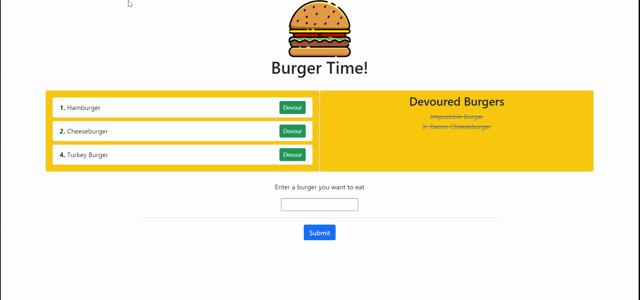

# Burger Time
<div>
  
  


</div>

### Full stack restaurant app using Node/Express/MySQL/Handlebars/Bootstrap
<br>

## Table of Contents  
* [Features](#Features)  
* [Installation](#Installation)  
* [Usage](#Usage)  
* [Technologies](#Technologies-Used)
* [Contributing](#Contributing) 
* [Questions](#Questions)

## Features
- Uses a custom made ORM to interact with MySQL database
- When user submits a burger, a new burger model is created in database
- When user 'devours' a burger they've created, it is updated accordingly in db

## Installation
1. Install npm packages:
    ```
    npm i mysql express express-handlebars
    ```
2. Create database in MySQL using the provided schema in `db` directory
    * Prepopulate with data from seed.sql file (optional)
3. Be sure to update `config/connection.js` with your specific MySQL configuration
4. Run `node server` in terminal and open `localhost:8080` (or your configured server port) in your browser.

## Usage
Currently deployed with [Heroku](https://jd-burger-time.herokuapp.com/)

1. Enter a burger you want to eat and it will be displayed in the left column.
2. Click `Devour` next to any existing burger to Devour it. It will be moved to the right 'Devoured Burgers' column.



## Technologies Used
- [Express.js](https://expressjs.com/)
- [Handlebars](https://handlebarsjs.com/)
- [MySQL](https://www.mysql.com/)

## Contributing
Contributions welcome!
1. Fork this repository  
2. Create a new branch  
3. Commit/push your changes  
4. Create a new pull request  

## Questions  
If you have any questions, feel free to create an [Issue](https://github.com/JoelDore/burger/issues) or contact me directly at dore.joel.dore@gmail.com

## License
This project is [MIT](https://github.com/JoelDore/burger/blob/main/LICENSE) licensed.  
© 2020 [Joel Dore](https://github.com/JoelDore)  

---
<br>

<div align="center">

[](https://github.com/JoelDore) 
[](https://www.linkedin.com/in/joeldore) 
<a href="https://www.buymeacoffee.com/JoelDore" target="_blank"></a>

</div>
